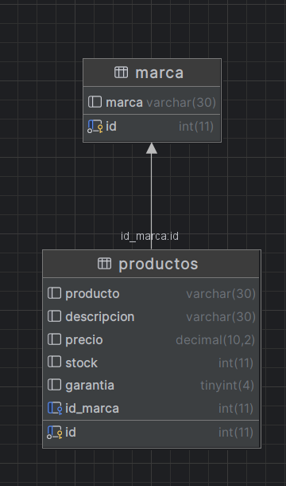

# Store Peru

API REST para gestionar marcas y productos.

># LEEME PRIMERO
> hola, este es el backend de la aplicacion, q funciona
> como un Api REST, pero este proyecto `ya está subido
> a un servidor vps propio`, por lo q no va a tener q ejecutarlo localmente.
> Solo dejo esto para q vea el back, e instale solo el cliente!!

## Base de datos




## Instalación

1. Clonar el repositorio
```
git clone https://github.com/fixfis70/StorePeru_ws
```

2. Instalar dependencias

`````npm install`````

3. Ejecutar el servidor

````node index.js````

## Endpoints

- GET /marca ->
Obtiene todas las marcas.

- POST /marca ->
Crea una nueva marca.

- GET /productos ->
Obtiene todos los productos.

- POST /productos -> Crea uno nuevo producto.

hay unos archivos http listos pa usarlos en postman.
en
````./requestHTTP/````
## Tecnologías

- Node.js
- Express
- MySQLz